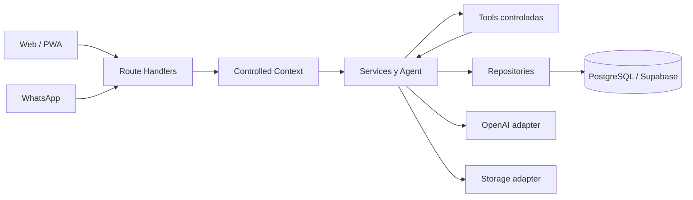

# HouseMate AI

HouseMate AI es un asistente financiero para hogares que reduce la fricción de registrar, consultar y repartir gastos e ingresos compartidos.

El proyecto combina una aplicación web responsive, un agente conversacional, un backend modular y PostgreSQL/Supabase. La aplicación permite consultar información financiera mediante lenguaje natural y exige confirmación antes de persistir operaciones iniciadas por el agente.

## Demo

- Aplicación desplegada: <https://housemate-ai.vercel.app/>

## Estado del proyecto

El repositorio contiene un MVP funcional en evolución incremental.

| Capacidad                                                       | Estado actual                                               |
| --------------------------------------------------------------- | ----------------------------------------------------------- |
| Web/PWA mínima                                                  | Implementada                                                |
| Dashboard financiero                                            | Implementado                                                |
| Gastos: crear, consultar, editar y eliminar                     | Implementado                                                |
| Ingresos: API completa; UI con registro, consulta y eliminación | Implementado parcialmente en la UI                          |
| Balance entre integrantes                                       | Implementado                                                |
| Categorías y reglas de reparto                                  | Lectura desde catálogos/seed                                |
| Agente conversacional Web                                       | Implementado con OpenAI Responses API                       |
| Confirmación de operaciones del agente                          | Implementada mediante propuestas pendientes                 |
| WhatsApp Cloud API                                              | Integración textual mediante webhook                        |
| Análisis de facturas                                            | Flujo backend de Storage/OCR implementado; UI web pendiente |
| Autenticación y administración multiusuario                     | Fuera del MVP                                               |

## Problema y propuesta de valor

Registrar cada gasto compartido suele requerir abrir una aplicación, completar formularios, buscar categorías, decidir porcentajes y hacer cálculos manuales. Esa fricción provoca que los registros se pospongan o se abandonen.

HouseMate AI propone una experiencia conversacional:

1. La persona escribe una consulta o describe una operación en lenguaje natural.
2. El agente interpreta la intención y consulta una herramienta controlada.
3. El backend valida el contexto, calcula los valores financieros y aplica las reglas de negocio.
4. Para una escritura, el agente presenta una propuesta y solicita confirmación.
5. Solo después de confirmar se persiste la operación.
6. Dashboard y balance consumen los datos persistidos.

La IA interpreta y coordina; el backend valida, calcula y ejecuta. PostgreSQL es la fuente de verdad de la información financiera.

## Funcionalidades

### Web/PWA

- Dashboard con ingresos, gastos, neto, cantidad de gastos y distribución por categoría.
- Visualización de ingresos por integrante.
- Registro de gastos con comercio, monto, fecha, pagador, categoría, descripción y regla de reparto.
- Edición y eliminación de gastos.
- Registro, consulta y eliminación de ingresos desde la interfaz actual.
- Consulta del balance de compensación entre integrantes.
- Consulta conversacional mediante el agente de HouseMate AI.
- Sugerencias de consultas para facilitar la demostración del agente.

### Agente

El agente puede interpretar, entre otras, estas intenciones:

- Crear un gasto.
- Consultar gastos.
- Crear y consultar ingresos.
- Consultar el balance.
- Consultar categorías.
- Consultar reglas de reparto.

Las operaciones de escritura utilizan `PendingProposal` y confirmación explícita. Si falta una categoría, el agente solicita una selección válida del catálogo disponible antes de crear la propuesta.

Ejemplos de consultas:

```text
¿Cuánto gastamos este mes?
¿Cuál es el balance entre nosotros?
¿Cuánto gastamos en alimentación?
Hoy pagué 80 mil en una cena.
```

### Gastos, reparto y balance

- `Expense` e `Income` son capacidades independientes.
- Los gastos pueden tener pagador, creador, categoría, items y distribución por integrante.
- Las reglas de reparto se consultan desde el catálogo del hogar.
- Las distribuciones se calculan en backend usando centavos enteros y se persisten junto con el gasto mediante operaciones atómicas.
- El balance utiliza únicamente gastos `CONFIRMED` y las distribuciones persistidas.
- Los ingresos no participan en el balance de compensación.

### WhatsApp y facturas

El backend incluye:

- Verificación y recepción de eventos de WhatsApp Cloud API.
- Validación de firma HMAC-SHA256.
- Resolución del integrante desde el identificador externo del remitente.
- Prevención de procesamiento duplicado mediante `ProcessedWhatsAppEvent`.
- Análisis de imágenes de facturas usando Supabase Storage y OpenAI.
- Estados de factura `PENDING`, `FAILED` y `PROCESSED`.
- Conservación de propuestas incompletas para solicitar aclaraciones sin crear automáticamente un gasto.

La interfaz principal actual está enfocada en la Web/PWA y no incluye todavía una pantalla completa para cargar facturas ni administración visual de WhatsApp.

## Arquitectura

HouseMate AI es un monolito modular. Los módulos se organizan por capacidad de negocio y mantienen una dirección de dependencias controlada:



La regla general es:

```text
Route / Channel
      ↓
Controlled Context
      ↓
Service
      ↓
Repository
      ↓
Infrastructure / PostgreSQL
```

Responsabilidades principales:

- `app/`: páginas, interfaz y Route Handlers HTTP.
- `modules/`: contexto, dominio, servicios, validaciones, repositorios y tools del agente.
- `infrastructure/`: clientes y adaptadores de Supabase, OpenAI, Storage y WhatsApp.
- `database/`: migraciones y seeds versionados.
- `tests/`: pruebas funcionales, integración SQL y regresiones por fase.
- `docs/`: visión, requisitos, arquitectura, contratos, seguridad y plan de implementación.

Las rutas no contienen cálculos financieros, SQL, acceso directo a Supabase ni selección de hogar desde datos enviados por el cliente.

## Stack tecnológico

| Capa                    | Tecnología                                          |
| ----------------------- | --------------------------------------------------- |
| Framework web y backend | Next.js `16.3.0`                                    |
| UI                      | React `19.2.8`                                      |
| Lenguaje                | TypeScript `5.9.3`                                  |
| Persistencia            | PostgreSQL administrado por Supabase                |
| Cliente de datos        | `@supabase/supabase-js` `2.100.0`                   |
| Agente/LLM              | OpenAI Responses API mediante adaptador server-only |
| Modelo configurado      | `gpt-4o-mini` para interpretación textual           |
| Storage                 | Supabase Storage                                    |
| Canal externo           | WhatsApp Cloud API                                  |
| Hosting previsto        | Vercel                                              |
| Calidad de código       | ESLint `9.39.5`, Prettier `3.9.6`                   |
| Gestor de paquetes      | npm                                                 |

## Requisitos previos

- Node.js 20 o superior.
- npm.
- Un proyecto de Supabase con PostgreSQL.
- Acceso a `psql` si se ejecutarán las pruebas SQL o se aplicarán migraciones desde la terminal.
- Una clave de OpenAI para el agente y OCR.
- Credenciales de WhatsApp Cloud API si se habilitará el webhook.

## Instalación local

1. Clona el repositorio y entra en la carpeta del proyecto.

   ```bash
   cd housemate-ai
   ```

2. Instala las dependencias.

   ```bash
   npm install
   ```

3. Crea el archivo local de variables de entorno.

   En PowerShell:

   ```powershell
   Copy-Item .env.example .env.local
   ```

   En macOS/Linux:

   ```bash
   cp .env.example .env.local
   ```

4. Completa `.env.local` con los valores de tu entorno. No subas este archivo a Git.

5. Aplica las migraciones y el seed de la base de datos antes de iniciar la aplicación.

6. Inicia el servidor de desarrollo:

   ```bash
   npm run dev
   ```

   La aplicación estará disponible normalmente en <http://localhost:3000>.

## Variables de entorno

`.env.example` contiene la lista completa de nombres esperados. Las variables sensibles deben permanecer únicamente en el servidor.

| Variable                         | Uso                                                                              |
| -------------------------------- | -------------------------------------------------------------------------------- |
| `SUPABASE_URL`                   | URL del proyecto Supabase                                                        |
| `SUPABASE_SERVICE_ROLE_KEY`      | Cliente administrativo server-only para persistencia; nunca exponer al navegador |
| `HOUSEMATE_MVP_HOUSEHOLD_ID`     | Hogar controlado del MVP para Web/PWA                                            |
| `HOUSEMATE_MVP_MEMBER_ID`        | Integrante/actor controlado del MVP                                              |
| `HOUSEMATE_MVP_CONVERSATION_KEY` | Clave server-side de continuidad conversacional                                  |
| `SUPABASE_RECEIPTS_BUCKET`       | Bucket de Storage para imágenes de facturas                                      |
| `OPENAI_API_KEY`                 | Interpretación textual y análisis OCR                                            |
| `WHATSAPP_ACCESS_TOKEN`          | Token de WhatsApp Cloud API                                                      |
| `WHATSAPP_VERIFY_TOKEN`          | Token usado durante la verificación del webhook                                  |
| `WHATSAPP_APP_SECRET`            | Validación de firma HMAC de WhatsApp                                             |
| `WHATSAPP_PHONE_NUMBER_ID`       | Número de WhatsApp desde el que se responden mensajes                            |
| `DATABASE_URL`                   | Conexión PostgreSQL utilizada principalmente por pruebas SQL y administración    |

Durante el MVP, el contexto Web/PWA se resuelve desde configuración server-side. El cliente no puede elegir el hogar, el actor o la conversación enviando esos valores en el body, query string, cookies o headers arbitrarios.

## Base de datos

Las migraciones están en `database/migrations/` y deben ejecutarse en orden lexicográfico, desde `0001` hasta la última versión disponible. El seed inicial está en `database/seeds/0001_initial_seed.sql`.

El seed proporciona datos mínimos para la demostración, incluyendo hogar, integrantes, categorías y reglas de reparto. No edites una migración que ya haya sido aplicada; crea una nueva migración versionada para cambios posteriores.

### Aplicación con `psql`

En PowerShell, con `DATABASE_URL` configurada:

```powershell
Get-ChildItem database/migrations/*.sql |
  Sort-Object Name |
  ForEach-Object {
    psql $env:DATABASE_URL -v ON_ERROR_STOP=1 -f $_.FullName
  }

psql $env:DATABASE_URL -v ON_ERROR_STOP=1 -f database/seeds/0001_initial_seed.sql
```

También es posible ejecutar los archivos, en el mismo orden, desde el SQL Editor de Supabase.

## Uso básico

### Dashboard

El dashboard muestra ingresos, gastos, neto, número de gastos, ingresos por integrante y distribución de gastos por categoría. Los valores agregados son calculados por el backend; la interfaz solo los presenta.

### Registro manual de un gasto

1. Abre la sección **Gastos**.
2. Completa comercio, total, fecha, pagador, regla de reparto y categoría.
3. Envía el formulario.
4. Confirma el resultado en el listado, dashboard y balance.

### Consulta al agente

1. Abre **Agente IA**.
2. Escribe una consulta como `¿Cuánto gastamos este mes?` o selecciona una sugerencia.
3. Revisa la respuesta calculada con datos reales del hogar.
4. Para una escritura, revisa la propuesta y responde con una confirmación explícita, por ejemplo `Sí, confirmar`.

Las operaciones financieras del agente no deben considerarse persistidas hasta completar la confirmación.

## API HTTP

La especificación canónica de request, response, filtros y códigos de error está en [`docs/architecture/api_contract.md`](docs/architecture/api_contract.md).

| Método   | Ruta                     | Propósito                                               |
| -------- | ------------------------ | ------------------------------------------------------- |
| `GET`    | `/api/categories`        | Obtener el catálogo global de categorías                |
| `GET`    | `/api/household-members` | Obtener integrantes legibles del hogar controlado       |
| `GET`    | `/api/sharing-rules`     | Obtener reglas de reparto del hogar                     |
| `GET`    | `/api/dashboard/summary` | Obtener agregados del dashboard; acepta `from` y `to`   |
| `GET`    | `/api/balance`           | Obtener balance de compensación                         |
| `GET`    | `/api/expenses`          | Listar gastos con filtros documentados                  |
| `POST`   | `/api/expenses`          | Crear un gasto confirmado desde un flujo autorizado     |
| `GET`    | `/api/expenses/{id}`     | Obtener el detalle de un gasto                          |
| `PATCH`  | `/api/expenses/{id}`     | Actualizar parcialmente un gasto                        |
| `DELETE` | `/api/expenses/{id}`     | Cancelar o eliminar un gasto según su estado            |
| `GET`    | `/api/incomes`           | Listar ingresos y resumen                               |
| `POST`   | `/api/incomes`           | Crear un ingreso                                        |
| `PATCH`  | `/api/incomes/{id}`      | Actualizar parcialmente un ingreso                      |
| `DELETE` | `/api/incomes/{id}`      | Eliminar físicamente un ingreso                         |
| `POST`   | `/api/agent`             | Procesar un mensaje conversacional Web                  |
| `POST`   | `/api/receipts/analyze`  | Analizar una imagen, reintentar o completar una factura |
| `GET`    | `/api/webhooks/whatsapp` | Verificar el webhook de WhatsApp                        |
| `POST`   | `/api/webhooks/whatsapp` | Recibir y procesar eventos de texto de WhatsApp         |

Ejemplo de consulta al agente en desarrollo:

```bash
curl -X POST http://localhost:3000/api/agent \
  -H "Content-Type: application/json" \
  -d '{"message":"¿Cuánto gastamos este mes?"}'
```

Los endpoints no aceptan `householdId`, identidad del actor ni otros campos de contexto enviados por el cliente como fuente de autoridad.

## Pruebas y validación

### Comprobaciones npm

```bash
npm run format:check
npm run lint
npm run typecheck
npm run build
```

El proyecto no define un script `npm test`. Los harnesses funcionales se ejecutan directamente con Node:

```bash
node tests/phase-6-web-functional.cjs
node tests/phase-6-agent-http-functional.cjs
```

También existen harnesses por fase para categorías, gastos, ingresos, dashboard, balance, agente, WhatsApp, facturas y contexto HTTP. Los scripts `.sql` requieren una instancia PostgreSQL/Supabase accesible mediante `DATABASE_URL`; las pruebas de integridad están diseñadas para ejecutarse dentro de transacciones y revertir sus fixtures cuando así lo indica el propio script.

Antes de declarar un incremento terminado, valida especialmente:

- aislamiento por hogar;
- validación de miembros, categorías y reglas;
- cálculos deterministas en centavos;
- participación exclusiva de gastos `CONFIRMED` en dashboard y balance;
- confirmación antes de escrituras del agente;
- sanitización de errores HTTP;
- idempotencia del webhook de WhatsApp;
- ausencia de secretos en el diff.

## Deployment en Vercel

1. Importa el repositorio en Vercel.
2. Usa la configuración estándar de Next.js; el comando de build es `npm run build`.
3. Configura en Vercel todas las variables necesarias de `.env.example` como variables server-side.
4. Aplica las migraciones y el seed en el proyecto Supabase de producción.
5. Verifica la aplicación y los endpoints principales después del despliegue.
6. Si habilitas WhatsApp, configura en Meta el webhook:

   ```text
   https://<tu-dominio>/api/webhooks/whatsapp
   ```

   Usa el mismo `WHATSAPP_VERIFY_TOKEN` configurado en Vercel y configura la firma de la aplicación con `WHATSAPP_APP_SECRET`.

7. Si habilitas facturas, crea/configura el bucket indicado por `SUPABASE_RECEIPTS_BUCKET` y verifica los permisos mínimos de Storage definidos en las migraciones.

Nunca incluyas `SUPABASE_SERVICE_ROLE_KEY`, `OPENAI_API_KEY`, tokens de WhatsApp, `.env.local` ni credenciales en el repositorio o en el código del cliente.

## Seguridad y límites del MVP

- El cliente no controla el hogar ni el actor; el backend resuelve el contexto desde variables server-side.
- Los repositories aplican filtros obligatorios por hogar y validan pertenencia de recursos.
- Las Route Handlers traducen errores internos a respuestas públicas sanitizadas.
- El agente no tiene acceso a SQL arbitrario, credenciales ni repositories.
- El LLM no es la fuente de verdad ni realiza los cálculos financieros definitivos.
- El service role de Supabase se utiliza únicamente en código de servidor.
- El MVP no incluye autenticación formal, roles, invitaciones ni administración completa de hogares.
- La configuración actual representa un hogar y actor controlados para el flujo inicial de demostración.
- La conversación Web utiliza una `HOUSEMATE_MVP_CONVERSATION_KEY` configurada server-side; todavía no existe una sesión Web independiente por usuario.

## Fuera del alcance actual y próximos pasos

Estas capacidades pertenecen a evoluciones posteriores o a incrementos pendientes:

- Autenticación, sesiones Web independientes y gestión multiusuario/multi-hogar.
- CRUD visual para categorías y reglas de reparto.
- Edición de ingresos desde la interfaz Web actual.
- Pantalla Web completa para cargar y confirmar facturas.
- Imágenes, audio y documentos enviados por WhatsApp.
- Comparaciones avanzadas entre periodos.
- Presupuestos, metas de ahorro, recordatorios y pagos.
- Integraciones bancarias.
- Aplicaciones móviles nativas.
- Recomendaciones financieras avanzadas y automatizaciones complejas.

Las prioridades del MVP deben mantenerse enfocadas en reducir la fricción del registro y demostrar al agente como interfaz principal del producto.

## Documentación del proyecto

Los documentos de arquitectura son la fuente de verdad para decisiones y contratos específicos:

- [Visión del producto](docs/vision/01_Project_Vision.md)
- [PRD](docs/vision/02_PRD.md)
- [Resumen de arquitectura](docs/architecture/architecture_overview.md)
- [Contexto C4](docs/architecture/c4_context.md)
- [Contenedores C4](docs/architecture/c4_container.md)
- [Stack tecnológico](docs/architecture/tech_stack.md)
- [Modelo de datos](docs/architecture/data_model.md)
- [Contrato de API](docs/architecture/api_contract.md)
- [Arquitectura del agente](docs/architecture/agent_architecture.md)
- [Plan de implementación](docs/architecture/implementation_plan.md)
- [Estructura del proyecto](docs/architecture/project_structure.md)
- [Seguridad](docs/architecture/security.md)
- [Hallazgos y deuda técnica](docs/architecture/audit_findings.md)

## Contribución

Los cambios deben respetar la dirección de dependencias:

```text
Route / Channel → Controlled Context → Service → Repository → Infrastructure
```

Antes de modificar un módulo:

1. Revisa la documentación de arquitectura relevante.
2. Define una whitelist explícita de archivos.
3. Mantén el aislamiento por hogar y la sanitización de errores.
4. Reutiliza services y calculadores existentes.
5. Ejecuta las validaciones relevantes.
6. Revisa el diff y no incluyas secretos, artefactos generados o cambios no relacionados.

## Licencia

El paquete está marcado como privado y actualmente no contiene un archivo `LICENSE`. No se debe asumir autorización para redistribuir o reutilizar el código fuera del contexto del proyecto.
