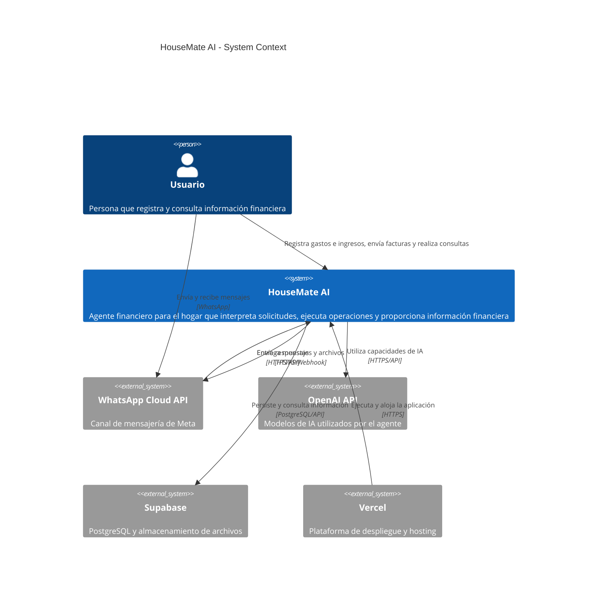

# C4 Context — HouseMate AI

Version: 1.0

---

# 1. Propósito

Este documento describe el contexto general de HouseMate AI utilizando el nivel 1 del modelo C4 (System Context Diagram).

Su objetivo es identificar:

- Los usuarios del sistema.
- El sistema principal.
- Los sistemas externos con los que interactúa.
- Las relaciones entre ellos.

Este documento no define componentes internos, endpoints, tablas ni detalles de implementación.

---

# 2. Sistema principal

## HouseMate AI

HouseMate AI es un asistente financiero para el hogar que permite registrar, consultar y analizar gastos e ingresos mediante lenguaje natural.

El sistema utiliza IA para interpretar las solicitudes del usuario, ejecutar operaciones mediante herramientas controladas y presentar información financiera útil.

Los principales canales de interacción serán:

- Aplicación Web / PWA.
- WhatsApp.

---

# 3. Actores

## 3.1 Usuario

Persona que utiliza HouseMate AI para gestionar sus gastos personales o los gastos compartidos de un hogar.

Puede:

- Registrar gastos.
- Consultar gastos.
- Editar y eliminar gastos.
- Registrar ingresos.
- Consultar ingresos.
- Editar y eliminar ingresos.
- Consultar balances.
- Consultar categorías.
- Enviar fotografías de facturas.
- Consultar y aplicar reglas de reparto preconfiguradas.
- Realizar preguntas sobre sus finanzas.
- Consultar información mediante lenguaje natural.

---

## 3.2 Integrante del hogar

Un integrante del hogar representa una persona que participa en los gastos compartidos.

El modelo conceptual contempla múltiples integrantes para permitir la evolución futura del producto.

Durante el MVP se trabajará con un único hogar y un contexto de usuario previamente configurado.

No se implementará inicialmente un sistema completo de gestión de usuarios, hogares o permisos.

---

# 4. Sistemas externos

## 4.1 WhatsApp Cloud API

Servicio externo de Meta que permite recibir y enviar mensajes de WhatsApp.

HouseMate AI utilizará este sistema como canal conversacional.

### Responsabilidades externas

- Entrega de mensajes entrantes.
- Entrega de imágenes enviadas por el usuario.
- Envío de respuestas al usuario.

### HouseMate AI no delegará en WhatsApp:

- Reglas de negocio.
- Cálculos financieros.
- Clasificación definitiva de gastos.
- Persistencia de información.

---

## 4.2 OpenAI API

Servicio externo utilizado para capacidades de inteligencia artificial.

HouseMate AI utilizará la API para:

- Comprensión de lenguaje natural.
- Interpretación de fotografías de facturas.
- Generación de respuestas.
- Funcionamiento del agente.

OpenAI no será responsable de la persistencia ni de la lógica financiera del sistema.

---

## 4.3 Supabase

Plataforma administrada utilizada por HouseMate AI para infraestructura de datos.

Se utilizará para:

- PostgreSQL.
- Storage de imágenes.

Supabase representa infraestructura del sistema y no contiene lógica de negocio.

---

## 4.4 Vercel

Plataforma de hosting utilizada para desplegar la aplicación.

Proporcionará:

- Hosting de la aplicación Next.js.
- HTTPS.
- Ejecución de backend/API.
- Despliegues automáticos.

---

# 5. Diagrama de contexto



---

# 6. Relaciones principales

## Usuario → HouseMate AI

El usuario proporciona información financiera, incluidos gastos e ingresos, y realiza consultas.

Puede interactuar mediante:

- Aplicación Web.
- PWA.
- WhatsApp.

---

## Usuario → WhatsApp

El usuario puede enviar mensajes y fotografías utilizando WhatsApp.

WhatsApp actúa como canal de comunicación y no como parte del dominio de HouseMate.

---

## WhatsApp → HouseMate AI

WhatsApp entrega mensajes entrantes mediante webhooks.

HouseMate AI procesa dichos mensajes y determina la acción correspondiente.

---

## HouseMate AI → WhatsApp

HouseMate AI genera una respuesta y la entrega mediante la API de WhatsApp.

---

## HouseMate AI → OpenAI

HouseMate AI utiliza modelos de IA para interpretar lenguaje natural, analizar facturas y generar respuestas.

La IA no tiene acceso directo a la base de datos.

---

## HouseMate AI → Supabase

HouseMate AI utiliza Supabase para almacenar y consultar información.

La persistencia se realiza mediante las capas de aplicación e infraestructura definidas en la arquitectura.

---

## Vercel → HouseMate AI

Vercel aloja y ejecuta la aplicación.

La relación con Vercel es una decisión de infraestructura y podrá modificarse posteriormente.

---

# 7. Principios derivados del contexto

## 7.1 Los canales son intercambiables

WhatsApp y Web/PWA son canales diferentes para interactuar con el mismo sistema.

La lógica del negocio no deberá duplicarse entre canales.

El agente será la interfaz conversacional principal. Web/PWA también podrá consumir directamente casos de uso controlados del backend para dashboard y operaciones explícitas.

---

## 7.2 WhatsApp no es el sistema

WhatsApp constituye una integración externa.

HouseMate AI debe continuar funcionando aunque WhatsApp no esté disponible.

---

## 7.3 La IA no es la fuente de verdad

OpenAI proporciona capacidades de interpretación y generación.

Los datos financieros y las reglas de negocio pertenecen exclusivamente a HouseMate AI.

---

## 7.4 Supabase no es el dominio

Supabase proporciona infraestructura.

El modelo de negocio y las reglas financieras pertenecen a HouseMate AI.

---

## 7.5 Los proveedores externos son reemplazables

Siempre que sea razonable, las integraciones externas deberán mantenerse desacopladas del dominio.

El objetivo no es implementar abstracciones innecesarias, sino evitar acoplamiento accidental.

---

# 8. Alcance del contexto para el MVP

El siguiente diagrama representa el alcance inicial:

```text
                         ┌─────────────────┐
                         │     Usuario     │
                         └────────┬────────┘
                                  │
                    ┌─────────────┴─────────────┐
                    │                           │
                    ▼                           ▼
             ┌────────────┐              ┌────────────┐
             │  Web / PWA │              │  WhatsApp  │
             └─────┬──────┘              └──────┬─────┘
                   │                            │
                   └────────────┬───────────────┘
                                ▼
                       ┌─────────────────┐
                       │   HouseMate AI  │
                       └────────┬────────┘
                                │
                    ┌───────────┼───────────┐
                    │           │           │
                    ▼           ▼           ▼
                OpenAI      Supabase     Vercel
```

---

# 9. Fuera del contexto del MVP

Los siguientes sistemas no forman parte del contexto inicial:

- Bancos.
- Pasarelas de pago.
- Sistemas contables.
- Servicios de presupuestos externos.
- Integraciones bancarias.
- Múltiples hogares.
- Sistemas empresariales.

Podrán incorporarse posteriormente sin modificar el concepto fundamental del sistema.

---

# 10. Riesgos identificados

## R-001 — Dependencia de WhatsApp

La integración depende de servicios externos y configuración de Meta.

Mitigación:

- Validar la integración durante las primeras etapas del desarrollo.
- Mantener Web/PWA como canal alternativo.
- Aislar WhatsApp mediante un adaptador.

---

## R-002 — Dependencia de proveedor de IA

La solución depende inicialmente de OpenAI.

Mitigación:

- Mantener la integración encapsulada.
- No incluir lógica de negocio dentro de prompts.
- Mantener las reglas financieras en el dominio.

---

## R-003 — Costos variables de IA

El procesamiento de conversaciones e imágenes genera consumo de API.

Mitigación:

- Utilizar modelos adecuados al nivel de complejidad.
- Evitar llamadas innecesarias.
- Limitar el contexto enviado al modelo.
- No procesar repetidamente una misma factura.

---

# 11. Decisiones importantes

### DEC-001

HouseMate AI será un monolito modular.

### DEC-002

WhatsApp será un canal externo y no una dependencia del dominio.

### DEC-003

OpenAI será un proveedor de IA y no la fuente de verdad financiera.

### DEC-004

Supabase será infraestructura administrada.

### DEC-005

Web/PWA funcionará como canal alternativo a WhatsApp.

### DEC-006

Las integraciones externas estarán aisladas de la lógica de negocio.

---

# 12. Documentos relacionados

- Project Vision
- Product Requirements Document
- Architecture Overview
- Tech Stack
- Data Model (`data_model.md`)
- Agent Architecture
- API Contract (`api_contract.md`)
- Security

---

# 13. Próximo paso

Antes de continuar con el diseño detallado de componentes, deberá realizarse una prueba técnica mínima de la integración con WhatsApp Cloud API.

Objetivo de la prueba:

```text
WhatsApp
    ↓
Meta
    ↓
Webhook público
    ↓
HouseMate AI
    ↓
Respuesta
    ↓
WhatsApp
```

La prueba no deberá implementar todavía:

- Agente.
- Base de datos.
- Dashboard.
- OCR.
- Reglas de negocio.

Su único objetivo será comprobar que el canal puede recibir y enviar mensajes correctamente dentro del plazo disponible del proyecto.
